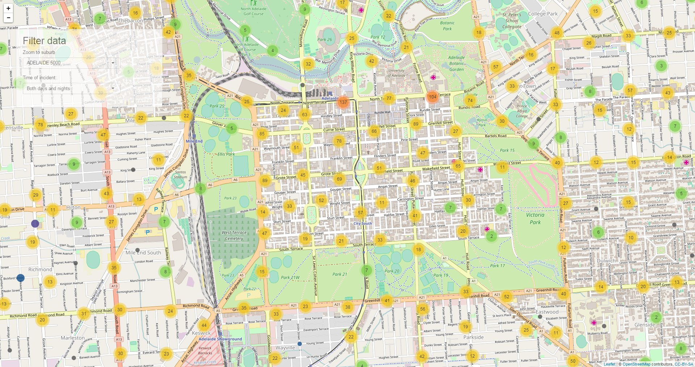
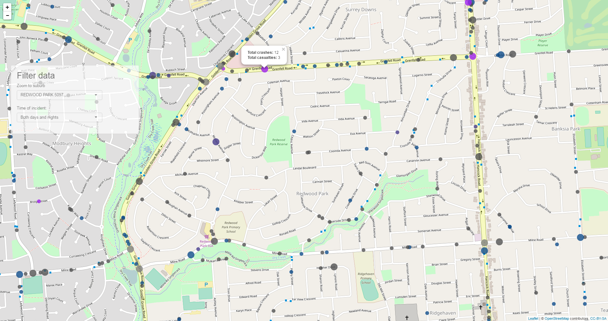

# Road-Accidents-Shiny-App
## Exploring South Australia's Road Accidents Data

## Demo

```R
## Install missing packages
packagesRequired <- c("shiny", "maptools", "dplyr",
                      "leaflet", "rgeos", "RColorBrewer",
                      "data.table")

packagesToInstall <- packagesRequired[!(packagesRequired %in%
                                          installed.packages()[,"Package"])]

if(length(packagesToInstall)) install.packages(packagesToInstall)

## Run app from Github repo
shiny::runGitHub('GowriSankar-JG/Road-Accidents-Shiny-App')
```

## Screenshots


<small>Preview 1 of Shiny App</small>


<small>Preview 2 of Shiny App</small>

## Data source

The data from Department of Planning, Transport and Infrastructure was obtained from https://data.sa.gov.au/data/dataset/road-crashes-in-sa

Bounding box for suburbs extracted from https://data.sa.gov.au/data/dataset/suburb-boundaries

## To-do

* Statistics of Data has being displayed
* Filter by time of Accident/Incidents 
